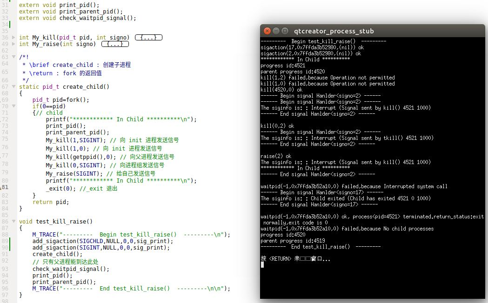
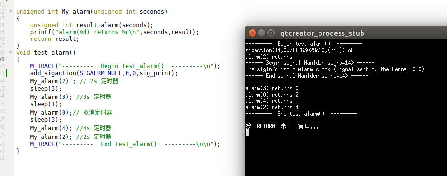
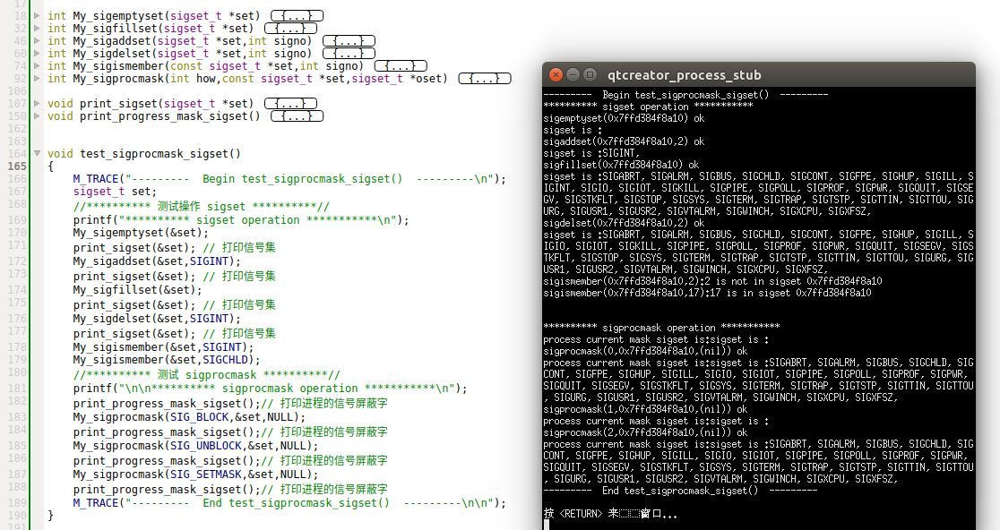
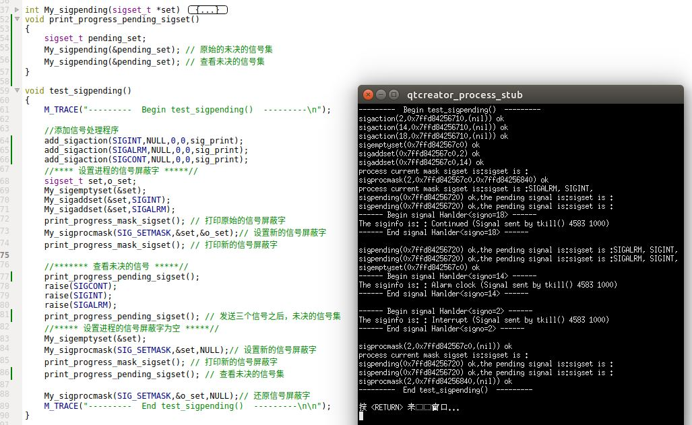
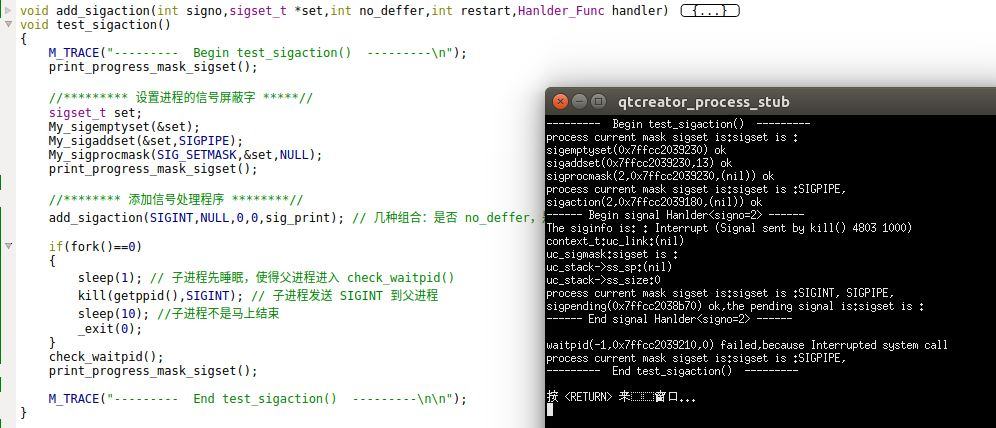
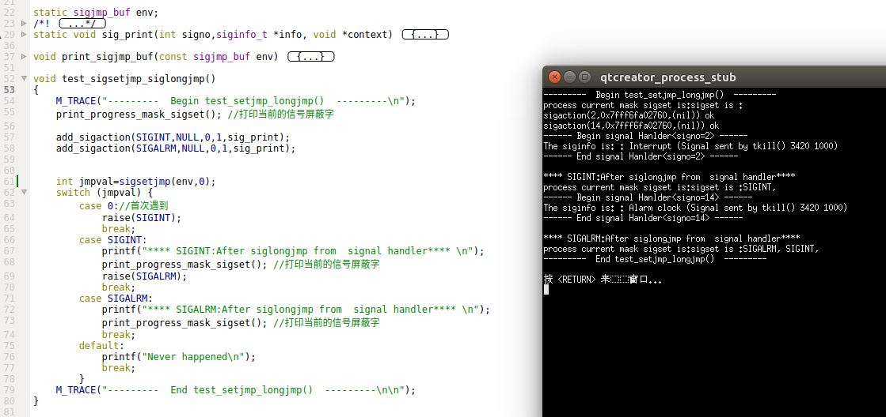
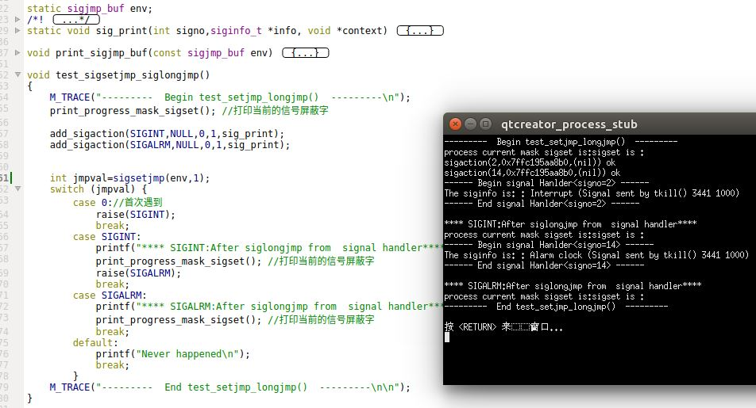
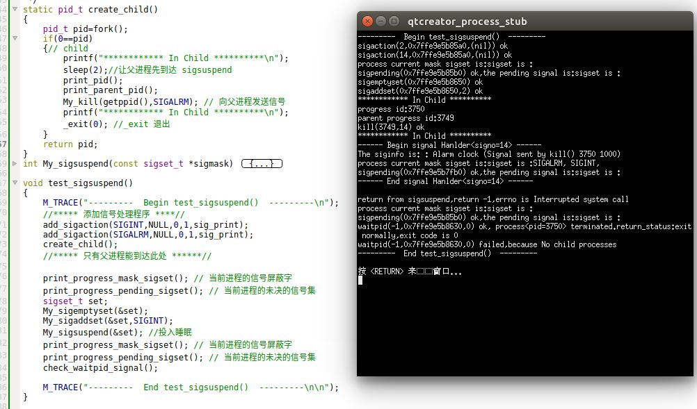
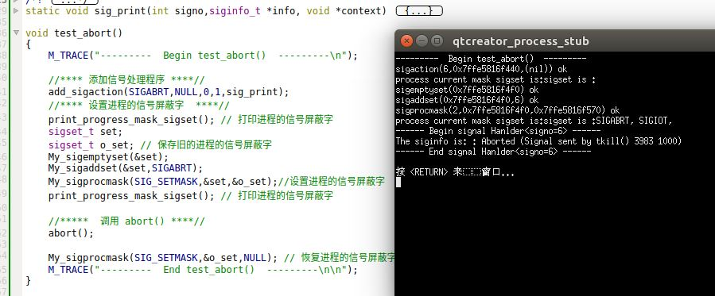
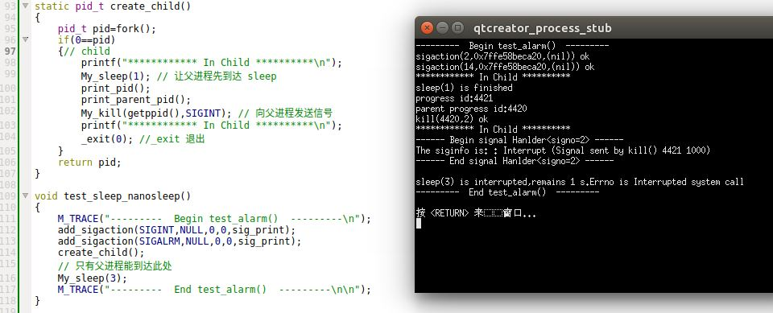

# 信号

## 信号的概念
1. 信号是软中断，它提供了一种处理异步事件的方法
	- 产生信号的事件对于进程而言是随机出现的
	- 进程不能简单的测试一个变量来判断是否发生了一个信号，而是必须告诉内核当某个信号发生时，执行哪些操作。
2. 每个信号都有一个名字，这些名字都以`SIG`开头：
	- 所有的信号名都被定义为正整数常量（信号编号），定义在头文件`<signal.h>`中
	- 不存在编号为 0 的信号，`POSIX`将 0 号编号值称作空信号
	- `Mac OS X 10.6.8`以及`Linux 3.2.0`都支持31种信号

3. 很多条件可以产生信号：
	- 当用户按某些终端键时，引发终端产生信号。如当用户在终端上按`Delete`键（通常是`Ctrl+C`）时，产生中断信号`SIGINT`
	- 硬件异常信号：除数为0、无效的内存引用等等
		> 这些条件通常由硬件检测到，并通知内核。然后内核为该条件发生时正在运行的进程产生适当的信号。如对执行一个无效内存引用的进程产生`SIGSEGV`信号
	- 进程调用`kill()`函数可将任意信号发送给另一个进程或者进程组
		> 要求接收信号的进程和发送信号的进程的所有者必须相同，或者发送信号的进程的所有者是超级用户
	- 用户可以用`kill`命令将任意信号发送给其他进程
		> 此命令只是`kill()`函数的接口。通常用于终止一个失控的后台进程
	- 当检测到某种软件条件已经发生并应将其通知有关进程时，也产生信号。如定时器超时的时候产生`SIGALRM`信号

4. 进程可以告诉内核当某个信号发生时，执行下列三种操作之一（我们称作信号处理）：
	- 忽略此信号。大多数信号都可以使用这种方式进行处理，但是`SIGKILL`和`SIGSTOP`信号决不能被忽略
		- `SIGKILL`和`SIGSTOP`向内核和超级用户提供了使进程终止或者停止的可靠方法
		- 如果忽略某些由硬件异常产生的信号（如非法内存引用或除以0），则进程的运行行为是未定义的
	- 捕捉信号。为了做到这一点，进程需要通知内核当某种信号发生时，调用一个用户函数。
		- 在用户函数中，内核执行进程希望对这种事件进行的处理
		- 注意无法捕捉`SIGKILL`和`SIGSTOP`信号
	- 执行系统默认动作。对大多数信号的系统默认动作是终止该进程。默认动作是忽略的常见的信号有：`SIGCANCEL`（线程库内部使用）、`SIGCHILD`（子进程状态改变）
5. 进程执行时，如果没有显式设定，则所有的信号的处理都为默认动作
	- 调用`fork`之后，子进程继承父进程的信号处理方式，因为子进程在开始时复制了父进程的进程空间
	- 对于子进程，`exec`函数会将原先设置为要捕捉的信号都改为默认动作，非捕捉的信号则不变。这是因为信号捕捉函数的地址很可能在新程序中没有任何意义

## 中断的系统调用

1. 如果进程在执行一个低速系统调用而阻塞期间捕捉到一个信号，则该系统调用就会被中断而不再继续执行。此时该系统调用返回出错，其`errno`设置为`EINTR`
	- 这么做的意义是因为一个信号发生了，进程捕捉到了它，意味着已经发生了某种事情，所以是个好机会应当唤醒阻塞的系统调用

2. 为了支持中断的系统调用，我们将系统调用分成两类：低速系统调用和非低速系统调用
	- 低速系统调用是可能使进程永远阻塞的一类系统调用，包括：
		- 如果某些类型文件（如读管道、终端设备、网络设备）的数据不存在，则读操作可能会使调用者永远阻塞
		- 如果写某些类型文件（如写管道、终端设备、网络设备），可能会使得调用者永远阻塞
		- `pause`函数（根据定义，它使调用进程休眠直到捕捉一个信号）和`wait`函数
		- 某些`ioctl`函数
		- 某些进程间通信函数

3. 为了帮助应用程序使其不必处理被中断的系统调用（即不需要人工来重新启动被中断的系统调用），`4.2BSD`引进了某些被中断的系统调用自动重启动
	- 自动重启动的系统调用包括`ioctl、read、readv、write、writev、wait、waitpid`
	- 有些情况下，可能我们并不希望这些函数被中断后重启动，因此`4.3BSD`运行进程基于每个信号禁用重启动功能
	- 需要自动重启动的原因是：有时候用户根本不知道所使用的输入、输出设备是否是低速设备。如果不提供重启动功能，则对每次`read、write`系统调用就要进行是否出错返回的测试；如果是被中断的，则需要再调用`read、write`系统调用
4.  `POSIX`要求：只有中断信号的`SA_RESTART`标志有效时，才重启动被该信号中断的系统调用

## 可重入函数
1. 进程捕捉到信号并对其进行处理时，进程正在执行的正常指令序列就被信号处理程序临时中断
	- CPU 首先执行该信号处理程序中的指令
	- 如果从信号处理程序返回，则继续执行进程正在执行的正常指令序列
		> 有可能无法从信号处理程序返回，如在信号处理程序中调用`_exit()`或者`longjmp`
	- 但是有个问题：在信号处理程序中，无法判断捕捉到信号的时候，进程执行到何处。
		- 如果在捕捉到信号的时候，进程正在执行`malloc`，那么在信号处理程序中，绝不应该再调用`malloc`。否则会破坏`malloc`维护的存储区链表
		- 对于某一类函数，如果在捕捉到信号的时候，进程正在执行这些函数，那么在信号处理程序中，可以安全的重复调用这些函数。这一类函数称作可重入函数

2. `SUS`规范说明了在信号处理程序中保证调用安全的函数。这些函数有以下特点：
	- 没有使用静态数据结构。使用了静态数据结构的函数不是可重入的
	- 没有调用`malloc`或者`free`。调用`malloc`或者`free`的函数不是可重入的
	- 没有使用标准`IO`函数。使用标准`IO`函数的函数不是可重入的。因为标准`IO`库很多都是用了全局数据结构

3. 当在信号处理函数中调用可重入函数时，应当在调用前保存`errno`，然后在调用后恢复`errno`
	- 因为可重入函数执行失败的时候，可能会修改全局的`errno`值。而这种改变并不属于进程的正常执行逻辑。

## 可靠信号术语

1. 当造成信号的事件发生时，内核为进程产生一个信号（或者说向进程发送一个信号）
	- 事件产生的原因不限，可以是硬件异常，也可以是软条件或者其他原因
	- 当信号产生时，内核在进程表中以某种方式设置一个标志
2. 当内核在进程表中以某种方式设置一个标志时，我们说向进程递送(`delivery`)了一个信号
	- 在信号产生(`generation`)和递送之间的很短的时间间隔内，信号时未决的(`pending`)
3. 进程可以阻塞信号的递送：
	- 如果为进程产生了一个信号，而这个信号时进程阻塞的，而且对该信号的动作是系统默认的或者捕捉该信号（即不是忽略），则内核为该进程将此信号一直保持为未决状态；直到该进程对此信号解除了阻塞或者将对此信号的动作更改为忽略
	- 进程可以调用`sigpending()`函数来判断哪些信号时设置为阻塞并且处于未决状态的
	- 如果在进程解除对某个信号的阻塞之前，这种信号发生了多次
		- `POSIX.1`运行系统递送该信号一次或者多次。如果递送该信号多次，则称这些信号进行了排队
		- 除非支持`POSIX.1`实时扩展，否则大多数`UNIX`并不对信号排队，而是只递送这种信号一次

4. 内核在递送一个信号给进程时才决定对此信号的处理方式（而不是在产生该信号的时候决定处理方式）。于是进程在信号递送给它之前仍可以改变对该信号的动作
	> 通常只有在信号被阻塞且处于未决状态下，我们才有机会改变对该信号的动作。如果该信号未被阻塞，则从信号产生到信号递送之间根本没有机会执行信号处理动作的改变

5. 如果有多个信号要递送给一个进程，则`POSIX.1`并没有规定这些信号的递送顺序

6. 每个进程都有一个信号屏蔽字`signal mask`，它规定了当前要阻塞递送到该进程的信号集。
	- 对于每种可能的信号，该屏蔽字中都有一位与之对应
	- 对于某种信号，如果其对应位已经被设置，则该信号当前是被阻塞的
	- 进程可以调用`sigprocmask`来检测和更改其当前信号屏蔽字
7. 信号编号可能会超过一个整型所包含的二进制位数，因此`POSIX.1`定义了数据类型`sigset_t`，它可以容纳一个信号集

## 信号处理

1. `signal`函数：设置信号处理函数（该函数没什么作用）

	```
	#include<signal.h>
	void (*signal(int signo,void (*func)(int)))(int);
	```
	为了简化分析，我们定义：`typedef void Sigfunc(int)`， `Sigfunc`为一个函数，它的参数为`int`，返回值为`void`。然后我们得到：
	
	```
	Sigfunc * signal(int signo,Sigfunc func);
	```
	- 参数：
		- `signo`：信号编号
		- `func`：针对该信号设置的信号处理函数的函数指针
			- 也可以是常量`SIG_IGN`，表示通知内核忽略此信号
			- 也可以是常量`SIG_DFL`，表示通知内核采用系统默认动作
	- 返回值：
		- 成功：返回以前的信号处理函数的函数指针
		- 失败：返回 `SIG_ERR`

	
	当`func`是我们指定的函数地址时，一旦指定的信号发生，内核就会调用此函数。我们称这种处理为捕捉该信号，称此函数为信号处理程序。
	> 在`<signal.h>`内部，我们可以找到声明：
	>
	```
	#define SIG_ERR (void (*)()) -1
	#define SIG_DFL (void (*)()) 0
	#define SIG_IGN (void (*)()) 1
	```

	`signal`函数由`ISO C`定义，由于`ISO C`不涉及多进程、进程组以及终端IO等，所以它对于信号的定义非常模糊，以至于对`UNIX`系统而言几乎毫无用处

2. `kill/raise`函数：发送信号给进程或者进程组

	```
	#include<signal.h>
	int kill(pid_t pid,int signo);
	int raise(int signo);
	```
	- 参数：
		- `signo`：要发送信号的信号编号
		
		对于`kill`函数：
		- `pid`：接受信号的进程或者进程组。分为四种情况：
			- `pid >0`：将信号发送给进程ID为`pid`的进程
			- `pid==0`：将信号发送给与发送进程属于同一个进程组的所有其他进程（这些进程的进程组ID等于发送进程的进程组ID ），且发送进程必须要有权限向这些进程发送信号
				> 注意：这里的所有其他进程不包括内核进程和`init`进程
			- `pid<0`：将该信号发送给其进程组ID等于`pid`绝对值，且发送进程具有权限向其发送信号的所有进程。
				>  注意：这里的所有其他进程不包括内核进程和`init`进程
			- `pid==-1`：将信号发送给发送进程有权限向他们发送信号的所有进程。
				>  注意：这里的所有其他进程不包括内核进程和`init`进程
	- 返回值：
		- 成功：返回 0
		- 失败： 返回 -1

	`raise`函数向进程自己发送信号；而`kill`函数可以发送信号给其他进程或者进程组，但是需要权限：
	- 超级用户可以将信号发送给任一进程
	- 非超级用户：发送进程的实际用户ID或者有效用户ID必须等于接收进程的实际用户ID或者有效用户ID
		- 如果操作系统支持`_POSIX_SAVED_IDS`，则检查接收进程的保存设置用户ID（而不是有效用户ID）
	- 有一个信号有例外：如果被发送的信号是`SIGCONT`，则发送进程可以将它发送给属于同一个会话的任一其他进程

	`kill`有两种经典应用场景：
	- 如果`kill`的`signo`参数为 0 ，则`kill`仍然执行正常的错误检查，但是不发送信号
		- 这常用于确定一个特定的进程是否仍然存在。如果向一个并不存在的进程发送空信号，则`kill`返回 -1， `errno`设置为`ESRCH`
		- 但是注意：`UNIX`系统每经过一定时间会重新使用销毁的进程的进程ID，所以可能存在某个给定进程ID的进程并不是你所期望的那个进程
	- 如果调用`kill`为本进程产生信号，而且此信号是不被阻塞的，那么可以确保在`kill`返回之前，任何其他未决的、非阻塞信号（包括`signo`信号）都被递送到本进程。

3. 示例

	```
#include <stdio.h>
#include<errno.h>
#include<string.h>
#include<signal.h>
#include<unistd.h>
void sig_print(int signo,siginfo_t *info, void *context)
{
    printf("SIGNAL_HANDLER:signal %s is caught, signo is %d\n",strsignal(signo),signo);
}
void add_sigaction(int signo)
{
    struct sigaction action;
    action.sa_sigaction=sig_print;
    action.sa_flags=SA_SIGINFO;
    if(sigaction(signo,&action,NULL)==-1)
    {
        printf("set sigaction for signal %s failed!,because %s\n",
			strsignal(signo),strerror(errno));
    }else
    {
        printf("set sigaction for signal %s successed\n",strsignal(signo));
    }
}
void test_kill(pid_t pid,int signo)
{
    if(kill(pid,signo)==-1)
    {
        printf("\tsend signal %s for process %d failed,because %s\n",
               strsignal(signo),pid,strerror(errno));
    }else
    {
        printf("\tsend signal %s for process %d succeed\n",strsignal(signo),pid);
    }
}
void test_raise(int signo)
{
    if(raise(signo)==-1)
    {
        printf("\tsend signal %s failed,because %s\n",
               strsignal(signo),strerror(errno));
    }else
    {
        printf("\traise signal %s succeed\n",strsignal(signo));
    }
}
void child()
{
    add_sigaction(SIGCHLD);
    add_sigaction(SIGINT);
    pid_t id;
    id=vfork();
    if(id==0)
    {// child

     printf("------Begin child------\n");
     printf("Kill process 1 with SIGINT\n");
     test_kill(1,SIGINT);
     printf("Kill process 1 with empty signal\n");
     test_kill(1,0);
     printf("Kill parent with empty signal\n");
     test_kill(getppid(),0);
     printf("Kill group with SIGINT\n");
     test_kill(0,SIGINT);
     printf("Self raise SIGINT\n");
     test_raise(SIGINT);
     printf("--------End child-------\n");
     _exit(0);
    }
}
int main(void)
{
    child();
    sleep(1);
    sleep(1);
    return 0;
}
	```
	

	可以看到：
	- 父进程注册的信号处理程序，在`fork`之后的子进程中还有效
	- 子进程没有权限向进程`pid`为 1 的`init`进程发送任何信号（哪怕是空信号）
	- 子进程向本进程组发送的`SIGINT`信号（`kill`的`pid`为 0）同时被子进程和父进程捕捉到了
	- 子进程向自己`raise`的`SIGINT`信号被自己捕捉到了
	- 子进程终止时，自动向父进程发送的`SIGCHLD`信号被父进程捕捉到了（为了让父进程不会提前终止，这里给了两个`sleep`操作）

4. `alarm`函数：为进程设置定时器

	```
	#include<unistd.h>
	unsigned int alarm(unsigned int seconds);
	```
	- 参数：
		- `seconds`：定时器超时需要经过的秒数。
	- 返回值： 0 或者以前设置的闹钟时间的剩余秒数

	`alarm`函数为进程设置一个定时器，在将来的`seconds`秒之后定时器超时。当定时器超时的时候，内核产生`SIGALRM`信号。该信号的默认动作是终止调用`alarm`函数的进程。
	> 由于进程调度的延迟，进程收到`SIGALRM`信号不是精确的`seconds`秒，而是要加上一个时间间隔

	- 如果我们向捕捉`SIGALRM`信号，则必须在调用`alarm`之前安装该信号的处理程序。如果我们在`alarm`之后才安装`SIGALRM`的信号处理程序，则可能在设定信号处理程序之前信号就产生了	

	每个进程只能拥有一个定时器。如果在调用`alarm`的时候，之前已经为该进程设置了定时器且该定时器尚未超时，则该定时器距离超时的残留时间作为本次`alarm`函数调用的返回值返回
	- 如果`seconds=0`，则取消旧定时器，此时并没有新设定一个定时器，进程不再拥有任何定时器。
	- 如果以`seconds>0`，则取消旧定时器，并设定新定时器（超时时间为`seconds`秒）

5. 示例

	```
#include <stdio.h>
#include<errno.h>
#include<string.h>
#include<signal.h>
#include<unistd.h>
void sig_print(int signo,siginfo_t *info, void *context)
{
    printf("SIGNAL_HANDLER:signal %s is caught, signo is %d\n",strsignal(signo),signo);
}
void add_sigaction(int signo)
{
    struct sigaction action;
    action.sa_sigaction=sig_print;
    action.sa_flags=SA_SIGINFO;
    if(sigaction(signo,&action,NULL)==-1)
    {
        printf("set sigaction for signal %s failed!,because %s\n",
			strsignal(signo),strerror(errno));
    }else
    {
        printf("set sigaction for signal %s successed\n",strsignal(signo));
    }
}
void test_alarm(unsigned int seconds)
{
    unsigned int remain=alarm(seconds);
    if(remain !=0)
    {
        printf("\tAn alarm already,its remain seconds is %d s\n",remain);
    }else
    {
        printf("\tThe only alarm is set ok\n");
    }
}
int main(void)
{
    add_sigaction(SIGALRM);
    printf("Set a new Alarm\n");
    test_alarm(2);// alarm after 2s
    sleep(3);//sleep 3s
    printf("Set a new Alarm\n");
    test_alarm(3);
    sleep(1);
    printf("Cancel the only Alarm\n");
    test_alarm(0); // cancel a alarm
    printf("Set a new  Alarm\n");
    test_alarm(4);
    printf("Set another  Alarm\n");
    test_alarm(2); // the second alarm
    return 0;
}

	```
	
 
	可以看到：
	- 以`seconds=0`调用`alarm`会取消当前的定时器，此时并不会调用信号处理程序。
	- 一旦进程终止，所有的定时器都无效。因为进程终止时释放了所有的资源，包括定时器。
	
6. `pause`函数：阻塞调用进程直到捕捉到一个信号

	```
	#include<unistd.h>
	int pause(void);
	```	
	- 返回值：一定是 -1， 且`errno`设置为`EINTR`

	只有执行了一个信号处理程序并且从其返回时，`pause`才返回。这种情况下`pause`返回 -1，	`errno`设置为`EINTR`	
	- 如果我们仅仅是想从`pause`返回，则信号处理程序可以什么都不做（函数体为空）

7. 示例：

	```
#include <stdio.h>
#include<errno.h>
#include<string.h>
#include<signal.h>
#include<unistd.h>
void sig_print(int signo,siginfo_t *info, void *context)
{
    printf("SIGNAL_HANDLER:signal %s is caught, signo is %d\n",
                strsignal(signo),signo);
}
void add_sigaction(int signo)
{
    struct sigaction action;
    action.sa_sigaction=sig_print;
    action.sa_flags=SA_SIGINFO;
    if(sigaction(signo,&action,NULL)==-1)
    {
        printf("set sigaction for signal %s failed!,because %s\n",
                    strsignal(signo),strerror(errno));
    }else
    {
        printf("set sigaction for signal %s successed\n",strsignal(signo));
    }
}
void test_pause()
{
    int result=pause();
    printf("return from pause, the return value is %d\n",result);
}
void child()
{
    add_sigaction(SIGINT);
    pid_t id;
    id=fork();
    if(id==0)
    {//child;
        test_pause();
        _exit(0);
    }else
    {
        sleep(2);
        kill(0,SIGINT);
    }
}
int main(void)
{
    child();
    return 0;
}
	```
	

	可以看到：
	- 父进程向进程组发送了`SIGINT`信号后，父进程和子进程的信号处理程序分别执行完毕，然后子进程中`pause`中返回，返回值一定是 -1。


8. 操作信号集的函数：

	```
	#include<singal.h>
	int sigemptyset(sigset_t *set); 
	int sigfillset(sigset_t *set);
	int sigaddset(sigset_t *set,int signo);
	int sigdelset(sigset_t *set,int signo);
	int sigismember(const sigset_t *set,int signo);
	```
	- 参数：
		- `set`：待处理的信号集的地址
		- `signo`：待处理的信号的编号
	- 返回值：
		- `sigemptyset`、`sigfillset`、`sigaddset`、`sigdelset` :成功返回 0，失败返回 -1
		- `sigismember`：如果为真，则返回 1；如果为假则返回 0

	`sigemptyset`清除`set`指向的信号集的所有信号（`set`之后就成为一个空的信号集）；`sigfillset`使得`set`指向的信号集包含所有的信号；`sigaddset`将信号`signo`添加到`set`指向的信号集中；`sigdelset`从`set`指向的信号集中删除信号`signo`；`sigismember`测试信号`signo`是否在`set`指向的信号集中

9. `sigprocmask`函数：检查、更改、或者同时检测更改进程的信号屏蔽字

	```
	#include<singal.h>
	int sigprocmask(int how,const sigset_t *restrict set,sigset_t *restrict oset);
	```
	- 参数：
		- `how`:如果`set`是非空指针，则它结合`set`一起指示了如何修改当前信号屏蔽字
		- `set`:如果`set`是非空指针，则它结合`how`一起指示了如何修改当前信号屏蔽字
		- `oset`:如果是非空指针，则进程的当前信号屏蔽字通过它返回
	- 返回值：
		- 成功返回 0
		- 失败返回 -1

	如果`set`是非空指针，则它结合`how`一起指示了如何修改当前信号屏蔽字
	- `how=SIG_BLOCK`：该进程新的信号屏蔽字是其当前信号屏蔽字和`set`指向的信号集的并集。即`set`包含了希望阻塞的信号
	-  `how=SIG_UBBLOCK`：该进程新的信号屏蔽字是其当前信号屏蔽字和`set`指向的信号集补集的并集。即`set`包含了希望解除阻塞的附加信号
	- `how=SIG_SETMASK`：该进程新的信号屏蔽字是`set`指向的值

	如果`set`是空指针，则不改变进程的信号屏蔽字，`how`的值没有任何意义
	>`sigprocmask`是仅为单线程定义的

	如果调用`sigprocmask`之前，进程有未决的某个信号；调用`sigprocmask`之后，解除了对该信号的屏蔽，则在`sigprocmask`返回之前，该信号的信号处理程序就被调用（而不是等到`sigprocmask`返回之后）

10. 示例：

	```
#include <stdio.h>
#include<unistd.h>
#include<signal.h>
#include<errno.h>
#include<string.h>
void print_sigset(sigset_t *set)
{
    printf("set is:\t");
    if(set==NULL)
    {
        printf("NULL\n");
        return ;
    }
    if(sigismember(set,SIGABRT)) printf("SIGABRT\t");
    if(sigismember(set,SIGALRM)) printf("SIGALRM\t");
    if(sigismember(set,SIGBUS)) printf("SIGBUS\t");
    if(sigismember(set,SIGCHLD)) printf("SIGCHLD\t");
    if(sigismember(set,SIGCONT)) printf("SIGCONT\t");
    if(sigismember(set,SIGFPE)) printf("SIGFPE\t");
    if(sigismember(set,SIGHUP)) printf("SIGHUP\t");
    if(sigismember(set,SIGILL)) printf("SIGILL\t");
    if(sigismember(set,SIGINT)) printf("SIGINT\t");
    if(sigismember(set,SIGIO)) printf("SIGIO\t");
    if(sigismember(set,SIGIOT)) printf("SIGIOT\t");
    if(sigismember(set,SIGKILL)) printf("SIGKILL\t");
    if(sigismember(set,SIGPIPE)) printf("SIGPIPE\t");
    if(sigismember(set,SIGPOLL)) printf("SIGPOLL\t");
    if(sigismember(set,SIGPROF)) printf("SIGPROF\t");
    if(sigismember(set,SIGPWR)) printf("SIGPWR\t");
    if(sigismember(set,SIGQUIT)) printf("SIGQUIT\t");
    if(sigismember(set,SIGSEGV)) printf("SIGSEGV\t");
    if(sigismember(set,SIGSTKFLT)) printf("SIGSTKFLT\t");
    if(sigismember(set,SIGSTOP)) printf("SIGSTOP\t");
    if(sigismember(set,SIGSYS)) printf("SIGSYS\t");
    if(sigismember(set,SIGTERM)) printf("SIGTERM\t");
    if(sigismember(set,SIGTRAP)) printf("SIGTRAP\t");
    if(sigismember(set,SIGTSTP)) printf("SIGTSTP\t");
    if(sigismember(set,SIGTTIN)) printf("SIGTTIN\t");
    if(sigismember(set,SIGTTOU)) printf("SIGTTOU\t");
    if(sigismember(set,SIGURG)) printf("SIGURG\t");
    if(sigismember(set,SIGUSR1)) printf("SIGUSR1\t");
    if(sigismember(set,SIGUSR2)) printf("SIGUSR2\t");
    if(sigismember(set,SIGVTALRM)) printf("SIGVTALRM\t");
    if(sigismember(set,SIGWINCH)) printf("SIGWINCH\t");
    if(sigismember(set,SIGXCPU)) printf("SIGXCPU\t");
    if(sigismember(set,SIGXFSZ)) printf("SIGXFSZ\t");
    printf("\n");
}
void test_sigprocmask(const sigset_t* new_set)
{
    sigset_t old_set;
    if(sigprocmask(SIG_SETMASK,new_set,&old_set)==-1)
    {
        printf("\tsigprocmask set new set failed,because %s\n",
                    strerror(errno));
    }else
    {
        printf("\tsigprocmask set new set ok,the old set ->");
        print_sigset(&old_set);
    }
}
int main(void)
{
    sigset_t set;
    sigemptyset(&set);
    printf("Will set sigset to emtpy\n");
    test_sigprocmask(&set);
    printf("Will set sigset:SIGINT\n");
    sigaddset(&set,SIGINT);
    test_sigprocmask(&set);
    printf("Will set sigset:SIGINT+SIGALRM\n");
    sigaddset(&set,SIGALRM);
    test_sigprocmask(&set);
    printf("Will set sigset:SIGALRM\n");
    sigdelset(&set,SIGINT);
    test_sigprocmask(&set);
    printf("The final sigset :\n");
    test_sigprocmask(&set);
    return 0;
}
	```
	
	
	这里用到了一个技巧：`sigprocmask(SIG_SETMASK,new_set,&old_set)`之后，如果想检验进程的当前屏蔽字，那么使用同样的`set`再调用一次`sigprocmask`，则`old_set`中返回的就是当前的信号屏蔽字
	> 前提是两次调用都成功，否则这就是个`BUG`

11. `sigpending`函数：返回当前进程的被阻塞而且未决的信号的集合

	```
	#include<singal.h>
	int sigpending(sigset_t *set);
	```
	- 参数：
		- `set`：指向一个信号集的指针，该信号集存放当前进程的被阻塞的，而且未决的信号
	- 返回值：
		- 成功：返回 0
		- 失败： 返回 -1

	对于调用进程而言，如果某个信号是被阻塞的，那么它一定无法递送，则该信号当前一定也是未决的。

12. 示例：

	```
#include <stdio.h>
#include<unistd.h>
#include<signal.h>
#include<errno.h>
#include<string.h>
void print_sigset(sigset_t *set)
{
    printf("set is:\t");
    if(set==NULL)
    {
        printf("NULL\n");
        return ;
    }
    if(sigismember(set,SIGABRT)) printf("SIGABRT\t");
    if(sigismember(set,SIGALRM)) printf("SIGALRM\t");
    if(sigismember(set,SIGBUS)) printf("SIGBUS\t");
    if(sigismember(set,SIGCHLD)) printf("SIGCHLD\t");
    if(sigismember(set,SIGCONT)) printf("SIGCONT\t");
    if(sigismember(set,SIGFPE)) printf("SIGFPE\t");
    if(sigismember(set,SIGHUP)) printf("SIGHUP\t");
    if(sigismember(set,SIGILL)) printf("SIGILL\t");
    if(sigismember(set,SIGINT)) printf("SIGINT\t");
    if(sigismember(set,SIGIO)) printf("SIGIO\t");
    if(sigismember(set,SIGIOT)) printf("SIGIOT\t");
    if(sigismember(set,SIGKILL)) printf("SIGKILL\t");
    if(sigismember(set,SIGPIPE)) printf("SIGPIPE\t");
    if(sigismember(set,SIGPOLL)) printf("SIGPOLL\t");
    if(sigismember(set,SIGPROF)) printf("SIGPROF\t");
    if(sigismember(set,SIGPWR)) printf("SIGPWR\t");
    if(sigismember(set,SIGQUIT)) printf("SIGQUIT\t");
    if(sigismember(set,SIGSEGV)) printf("SIGSEGV\t");
    if(sigismember(set,SIGSTKFLT)) printf("SIGSTKFLT\t");
    if(sigismember(set,SIGSTOP)) printf("SIGSTOP\t");
    if(sigismember(set,SIGSYS)) printf("SIGSYS\t");
    if(sigismember(set,SIGTERM)) printf("SIGTERM\t");
    if(sigismember(set,SIGTRAP)) printf("SIGTRAP\t");
    if(sigismember(set,SIGTSTP)) printf("SIGTSTP\t");
    if(sigismember(set,SIGTTIN)) printf("SIGTTIN\t");
    if(sigismember(set,SIGTTOU)) printf("SIGTTOU\t");
    if(sigismember(set,SIGURG)) printf("SIGURG\t");
    if(sigismember(set,SIGUSR1)) printf("SIGUSR1\t");
    if(sigismember(set,SIGUSR2)) printf("SIGUSR2\t");
    if(sigismember(set,SIGVTALRM)) printf("SIGVTALRM\t");
    if(sigismember(set,SIGWINCH)) printf("SIGWINCH\t");
    if(sigismember(set,SIGXCPU)) printf("SIGXCPU\t");
    if(sigismember(set,SIGXFSZ)) printf("SIGXFSZ\t");
    printf("\n");
}
void test_sigpending()
{
    sigset_t set;
    if (sigpending(&set)==-1)
    {
        printf("sigpending error,because %s \n",strerror(errno));
    }else
    {
        printf("The pending signal is :\t");
        print_sigset(&set);
    }
}
int main(void)
{
    sigset_t set;
    sigemptyset(&set);
    sigaddset(&set,SIGINT);
    sigaddset(&set,SIGALRM);
    sigprocmask(SIG_SETMASK,&set,NULL);
    printf("Will raise SIGINT:\n");
    raise(SIGINT);
    test_sigpending();
    printf("Will raise SIGALRM:\n");
    raise(SIGALRM);
    test_sigpending();
    return 0;
}
	```
	

13. `sigaction`函数：检查或者修改指定信号相关联的处理动作。它取代了UNIX早期使用的`signal`函数

	```
	#include<signal.h>
	int sigaction(int signo,const struct sigaction *restrict act
			,struct sigaction*restrict oact);
	```
	- 参数：
		- `signo`：指定处理的信号的编号
		- `act`：如果非`NULL`，则它指定的数据结构指定了对该信号执行的动作
		- `oact`：如果非`NULL`，则它指向的数据结构中返回该信号的上一个动作
	- 返回值：
		- 成功，返回 0
		- 失败，返回 -1

	`struct sigaction`的结构为：

	```
	struct sigaction{
		void (*sa_handler)(int); //可以为 SIG_IGN、SIG_DFL或者信号处理函数的地址
		sigset_t sa_mask; //额外需要屏蔽的信号
		int sa_flags; // 标志位
		void (*sa_sigaction)(int,siginfo_t *,void*); //可选的另一种信号处理函数
	```

	下面讲解`sigaction`个字段的意义：
	- `sa_handler`：对该信号执行的信号处理函数的地址或者` SIG_IGN、SIG_DFL`
	- `sa_mask`：	当设置信号处理程序时，如果`sa_handler`字段包含了一个信号捕捉函数的地址（不是常量`SIG_IGN`，也不是常量`SIG_DFL`），则`sa_mask`字段说明了一个信号集。
		- 在调用该信号捕捉函数之前，这一信号集要加到进程的信号屏蔽字中
			> 这是为了确保在信号处理函数执行过程中，额外的屏蔽某些信号
		- 仅当从信号捕捉函数返回时，再将进程的信号屏蔽字恢复为原先值。这样在调用信号处理程序时就能够阻塞某些信号
		- 在信号处理程序被调用时，操作系统建立的新的信号屏蔽字包括了正在被递送的信号。确保了在处理一个给定的信号时，如果这种信号多次发生，那么它会被阻塞到对当前信号的处理结束为止。同时多次发生的这种信号并不会被排队，而是只登记为一次。
			> 通常你并不需要在`sa_mask`中添加`signo`，因为这是操作系统默认帮你处理的

		一旦对给定的信号设置了一个动作，那么在调用`sigaction`显式改变它之前，该设置就一直有效。

	- `sa_flags`字段指定对信号进行处理的各个选项：
		- `SA_INTERRUPT`：由此信号中断的系统调用不会自动重启动
		- `SA_NOCLDSTOP`：如果`signo`是`SIGCHLD`，则当子进程停止时，不产生此信号。
		- `SA_NOCLDWAIT`：如果`signo`是`SIGCHLD`，则当调用进程的子进程终止时，不创建僵死进程。
			> 若进程随后调用`wait`，则阻塞到它所有子进程都终止，此时返回 -1 ，`errno`设置为`ECHILD`
		- `SA_NODEFER`：当捕捉到信号时，在执行其信号捕捉函数时，系统并不自动阻塞此信号
			> 这意味着，如果在信号捕捉函数执行期间，该信号又发生了，则会执行新一轮的信号捕捉函数
		- `SA_RESETHAND`：在信号处理函数的入口处，将此信号的处理方式重置为`SIG_DFL`，并清除`SA_SIGINFO`标志。
			> 这意味着所建立的信号处理函数只是一次性的。下一次信号递送时，采用默认的`SIG_DFL`
		- `SA_RESTART`：由此信号中断的系统调用自动重启动
		- `SA_SIGINFO`：此选项对信号处理程序提供了附加信息：一个指向`siginfo`结构的指针，以及一个指向进程上下文标志符的指针
			> 此时对应的是字段 `void (*sa_sigaction)(int,siginfo_t *,void*);`
	- `sa_sigaction`：它是一个替代的信号处理程序，当`sa_flags`中设置了`SA_SIGINFO`标志时使用`sa_sigaction`。
		- 对于`sa_sigaction`和`sa_handler`，你只能选择使用这两个字段中的一个
		- 通常按照下列方式调用信号处理程序： `void handler(int signo);`
		- 但是如果设置了`SA_SIGINFO`标志，则按照下列方式调用信号处理程序： `void handler(int signo,siginfo_t *info,void* context);`。其中`siginfo_t`结构包含了信号产生原因的有关信息，结构大致如下：
		
			```
		struct siginfo{
			int si_signo; //信号编号
			int si_errno; //如果非零，则为 errno
			int si_code;  //额外的信息
			pid_t si_pid; //sending process ID
			uid_t si_uid;  // sending process real user ID
			void *si_addr; // address that caused the fault
			int si_status; //退出状态或者信号编号
			union sigval si_value; //application-specific value
			```
			- 如果信号是`SIGCHLD`，则将设置`si_pid`、`si_status`、`si_uid`字段
			- 如果信号是`SIGBUS`、`SIGILL`、`SIGFPE`、`SIGSEGV`，则`si_addr`包含了造成故障的根源地址，该地址可能并不准确。`si_errno`字段包含了错误编号，它对应了造成信号产生的条件，并由操作系统定义
		
			其中`code`给出了信号产生的详细信息，它有一些常量定义。如`SIGCHLD`信号中，`code`可以为：`CLD_EXITED`、`CLD_KILLED`、`CLD_STOPPED`....

			其中 `union sigval`包含：
			
			```
			union sigval{
				int sival_int;
				void* sival_ptr;
			}			
			```
			应用程序在递送信号时，在`si_value.sival_int`中传递一个整数或者在`si_value.sival_ptr`中传递一个指针
		- `context`参数是无类型指针，它可以被强制转换为`ucontext_t`结构指针，`ucontext_t`结构标识信号传递时进程的上下文。该结构至少包含下列字段：

			```
			ucontext_t *uc_link; //指向当前上下文结束后，要返回的上下文的地址
			sigset_t uc_sigmask; // 当前上下文执行时，阻塞的信号集
			stack_t uc_stack; //当前上下文使用的栈
			mcontext_t uc_mcontext;// machine-specific representation of saved context
			```
			`uc_stack`字段描述了当前上下文使用的栈，至少包含下列成员：

			```
			void *ss_sp;   // 栈基指针
			size_t ss_size;// 栈大小
			nt ss_flags;   // 栈标识
			```

14. 示例：

	```
#include <stdio.h>
#include<unistd.h>
#include<signal.h>
#include<errno.h>
#include<string.h>
void print_context_t(ucontext_t *t)
{
    printf("In context:\t");
    print_sigset(&t->uc_sigmask);
}
void print_current_sigset()
{
    sigset_t old_set;
    sigset_t set;
    sigemptyset(&set);
    sigprocmask(SIG_BLOCK,&set,&old_set);
    printf("The current sigset is:\t");
    print_sigset(&old_set);
}
void print_sigset(sigset_t *set)
{
    printf("set is:\t");
    if(set==NULL)
    {
        printf("NULL\n");
        return ;
    }
    if(sigismember(set,SIGABRT)) printf("SIGABRT\t");
    if(sigismember(set,SIGALRM)) printf("SIGALRM\t");
    if(sigismember(set,SIGBUS)) printf("SIGBUS\t");
    if(sigismember(set,SIGCHLD)) printf("SIGCHLD\t");
    if(sigismember(set,SIGCONT)) printf("SIGCONT\t");
    if(sigismember(set,SIGFPE)) printf("SIGFPE\t");
    if(sigismember(set,SIGHUP)) printf("SIGHUP\t");
    if(sigismember(set,SIGILL)) printf("SIGILL\t");
    if(sigismember(set,SIGINT)) printf("SIGINT\t");
    if(sigismember(set,SIGIO)) printf("SIGIO\t");
    if(sigismember(set,SIGIOT)) printf("SIGIOT\t");
    if(sigismember(set,SIGKILL)) printf("SIGKILL\t");
    if(sigismember(set,SIGPIPE)) printf("SIGPIPE\t");
    if(sigismember(set,SIGPOLL)) printf("SIGPOLL\t");
    if(sigismember(set,SIGPROF)) printf("SIGPROF\t");
    if(sigismember(set,SIGPWR)) printf("SIGPWR\t");
    if(sigismember(set,SIGQUIT)) printf("SIGQUIT\t");
    if(sigismember(set,SIGSEGV)) printf("SIGSEGV\t");
    if(sigismember(set,SIGSTKFLT)) printf("SIGSTKFLT\t");
    if(sigismember(set,SIGSTOP)) printf("SIGSTOP\t");
    if(sigismember(set,SIGSYS)) printf("SIGSYS\t");
    if(sigismember(set,SIGTERM)) printf("SIGTERM\t");
    if(sigismember(set,SIGTRAP)) printf("SIGTRAP\t");
    if(sigismember(set,SIGTSTP)) printf("SIGTSTP\t");
    if(sigismember(set,SIGTTIN)) printf("SIGTTIN\t");
    if(sigismember(set,SIGTTOU)) printf("SIGTTOU\t");
    if(sigismember(set,SIGURG)) printf("SIGURG\t");
    if(sigismember(set,SIGUSR1)) printf("SIGUSR1\t");
    if(sigismember(set,SIGUSR2)) printf("SIGUSR2\t");
    if(sigismember(set,SIGVTALRM)) printf("SIGVTALRM\t");
    if(sigismember(set,SIGWINCH)) printf("SIGWINCH\t");
    if(sigismember(set,SIGXCPU)) printf("SIGXCPU\t");
    if(sigismember(set,SIGXFSZ)) printf("SIGXFSZ\t");
    printf("\n");
}
void sig_print(int signo,siginfo_t *info, void *context)
{
    printf("Begin signal Hanlder:\n");
    psiginfo(info,"The siginfo is:\t");
    print_context_t((ucontext_t *)context);
    print_current_sigset();
    printf("End signal Hanlder:\n");
}
void add_sigaction(int signo)
{
    sigset_t set;
    sigemptyset(&set);
    sigaddset(&set,SIGALRM);

    struct sigaction action;
    action.sa_sigaction=sig_print;
    action.sa_flags=SA_SIGINFO;
    action.sa_mask=set;
    if(sigaction(signo,&action,NULL)==-1)
    {
        printf("set sigaction for signal %s failed!,because %s\n",
			strsignal(signo),strerror(errno));
    }else
    {
        printf("set sigaction for signal %s successed\n",strsignal(signo));
    }
}
int main(void)
{
    print_current_sigset();
    sigset_t set;
    sigemptyset(&set);
    sigaddset(&set,SIGPIPE);
    sigprocmask(SIG_SETMASK,&set,NULL);
    printf("After block SIGPIPE:\t");
    print_current_sigset();

    add_sigaction(SIGINT);
    raise(SIGINT);
    printf("Then :\t");
    print_current_sigset();
    return 0;
}
	```
	
	
	进程的信号屏蔽字被设置为`SIGPIPE`，信号处理程序的`sa_mask`被设置为`SIGALRM`。可以看到
	- 进程的信号屏蔽字始终是`SIGPIPE`
	- 在信号处理程序中，进程的信号屏蔽字是`SIGPIPE,SIGALRM,SIGINT`，即原始信号屏蔽字、`sa_mask`以及处理的信号三者的并集
	- 在信号处理程序中，`context`参数保存了跳转到进程正常执行路径的一些上下文，最典型的是`context->uc_sigmask`保存了进程的原始信号屏蔽字
			
15. `sigsetjmp/siglongjmp`函数：用于信号处理程序中的跳转函数

	```
	#include<setjmp.h>
	int sigsetjmp(sigjmp_buf env,int savemask);
	void siglongjmp(sigjmp_buf env,int val);
	```
	对于 `sigsetjmp`：
	- 参数：
		- `env`：一个`sigjmp_buf`结构。由`sigsetjmp`函数使用它与`siglongjmp`之间通信
		- `savemask`：调用`siglongjmp`时，如果`savemask`非0，则`siglongjmp`跳转会自动恢复保存的信号屏蔽字；如果为0，则`siglongjmp`跳转时不会自动恢复保存的信号屏蔽字。
	- 返回值：
		- 若直接调用，则返回0
		- 若从`siglongjmp`调用返回，则返回`siglongjmp`的`val`参数

	对于 `siglongjmp`：
	- 参数：
		- `env`：一个`sigjmp_buf`结构。由`siglongjmp`函数使用它与`sigsetjmp`之间通信
		- `val`：用于跳转到`sigsetjmp`，并作为`sigsetjmp`的返回值

	在信号处理程序中直接使用`longjmp/setjmp`有个问题：当捕捉到一个信号并进入信号处理程序中时，此时当前信号自动的加到进程的信号屏蔽字中。如果`longjmp`跳出了信号处理程序，那么此时进程的信号屏蔽字并不恢复。因此提供了`sigsetjmp/siglongjmp`函数。`sigsetjmp/siglongjmp`函数与`longjmp/setjmp`的唯一区别是：`sigsetjmp`增加了一个参数`savemask`，`savemask`非0则`siglongjmp`跳转时会自动恢复保存的信号屏蔽字。
	
	注意：`savemask`非0时，调用`sigsetjmp`会在`env`中记录下当前的信号屏蔽字。如果后续`siglongjmp`跳转，则恢复的是`sigsetjmp`时的信号屏蔽字，而不是进入信号处理程序之前时刻的信号屏蔽字。


16. 示例：

	```
#include <stdio.h>
#include<unistd.h>
#include<signal.h>
#include<errno.h>
#include<string.h>
#include<setjmp.h>
sigjmp_buf env;
void print_current_sigset()
{
    sigset_t old_set;
    sigset_t set;
    sigemptyset(&set);
    sigprocmask(SIG_BLOCK,&set,&old_set);
    printf("The current sigset is:\t");
    print_sigset(&old_set);
}
void print_sigset(sigset_t *set)
{
    printf("set is:\t");
    if(set==NULL)
    {
        printf("NULL\n");
        return ;
    }
    if(sigismember(set,SIGABRT)) printf("SIGABRT\t");
    if(sigismember(set,SIGALRM)) printf("SIGALRM\t");
    if(sigismember(set,SIGBUS)) printf("SIGBUS\t");
    if(sigismember(set,SIGCHLD)) printf("SIGCHLD\t");
    if(sigismember(set,SIGCONT)) printf("SIGCONT\t");
    if(sigismember(set,SIGFPE)) printf("SIGFPE\t");
    if(sigismember(set,SIGHUP)) printf("SIGHUP\t");
    if(sigismember(set,SIGILL)) printf("SIGILL\t");
    if(sigismember(set,SIGINT)) printf("SIGINT\t");
    if(sigismember(set,SIGIO)) printf("SIGIO\t");
    if(sigismember(set,SIGIOT)) printf("SIGIOT\t");
    if(sigismember(set,SIGKILL)) printf("SIGKILL\t");
    if(sigismember(set,SIGPIPE)) printf("SIGPIPE\t");
    if(sigismember(set,SIGPOLL)) printf("SIGPOLL\t");
    if(sigismember(set,SIGPROF)) printf("SIGPROF\t");
    if(sigismember(set,SIGPWR)) printf("SIGPWR\t");
    if(sigismember(set,SIGQUIT)) printf("SIGQUIT\t");
    if(sigismember(set,SIGSEGV)) printf("SIGSEGV\t");
    if(sigismember(set,SIGSTKFLT)) printf("SIGSTKFLT\t");
    if(sigismember(set,SIGSTOP)) printf("SIGSTOP\t");
    if(sigismember(set,SIGSYS)) printf("SIGSYS\t");
    if(sigismember(set,SIGTERM)) printf("SIGTERM\t");
    if(sigismember(set,SIGTRAP)) printf("SIGTRAP\t");
    if(sigismember(set,SIGTSTP)) printf("SIGTSTP\t");
    if(sigismember(set,SIGTTIN)) printf("SIGTTIN\t");
    if(sigismember(set,SIGTTOU)) printf("SIGTTOU\t");
    if(sigismember(set,SIGURG)) printf("SIGURG\t");
    if(sigismember(set,SIGUSR1)) printf("SIGUSR1\t");
    if(sigismember(set,SIGUSR2)) printf("SIGUSR2\t");
    if(sigismember(set,SIGVTALRM)) printf("SIGVTALRM\t");
    if(sigismember(set,SIGWINCH)) printf("SIGWINCH\t");
    if(sigismember(set,SIGXCPU)) printf("SIGXCPU\t");
    if(sigismember(set,SIGXFSZ)) printf("SIGXFSZ\t");
    printf("\n");
}
void sig_print_and_long_jmp(int signo,siginfo_t *info, void *context)
{
    printf("Begin signal Hanlder:\n");
    psiginfo(info,"The siginfo is:\t");
    siglongjmp(env,signo);
    printf("End signal Hanlder:\n");
}
void add_sigaction(int signo)
{
    struct sigaction action;
    action.sa_sigaction=sig_print_and_long_jmp;
    action.sa_flags=SA_SIGINFO;
    if(sigaction(signo,&action,NULL)==-1)
    {
        printf("set sigaction for signal %s failed!,because %s\n",strsignal(signo),
		strerror(errno));
    }else
    {
        printf("set sigaction for signal %s successed\n",strsignal(signo));
    }
}
int main(void)
{
    add_sigaction(SIGINT);
    add_sigaction(SIGALRM);
    print_current_sigset();
    int jmpval=sigsetjmp(env,0);
    switch (jmpval) {
    case 0:
        raise(SIGINT);
        break;
    case SIGINT:
        printf("SIGINT:After longjmp from  sig handler\t");
        print_current_sigset();
        raise(SIGALRM);
        break;
    case SIGALRM:
        printf("SIGALRM:After longjmp from  sig handler\t");
        print_current_sigset();
        break;
    default:
        printf("Never happened\n");
        break;
    }
    return 0;
}
	```
	

	这里`sigsetjmp(sigjmp_buf env,int savemask)`的`savemask`参数为零，表示不恢复进程的信号屏蔽字。因此可以看到从`SIGINT`的信号处理函数跳转出来后，进程的信号屏蔽字添加了`SIGINT`；从`SIGALRM`的信号处理函数跳转出来后，进程的信号屏蔽字添加了`SIGALRM`。

	如果`savemask`参数为1，则运行结果如下，可见从信号处理函数跳转出来后，进程的信号屏蔽字恢复了：
	


17. `sigsuspend`函数：用于原子性的修改信号屏蔽字然后进程睡眠

	```
	#include<signal.h>
	int sigsuspend(const sigset_t *sigmask);
	```
	- 参数：
		- `sigmask`：进程的信号屏蔽字修改为`sigmask`指向的值
	- 返回值：-1，并将`errno`设置为`EINTER`

	`sigsuspend`将进程的信号屏蔽字设置为`sigmask`指向的值	，然后将进程投入睡眠，这两步是原子的。如果不是原子的，可能在修改屏蔽字之后，进程睡眠之前发生了信号递送，则进程的睡眠不会被该信号打断（信号发生在进程睡眠之前）。

	`sigsuspend`在捕捉到一个信号（该信号未被`sigmask`屏蔽）或者发生了一个会终止进程的信号之前，进程被挂起。如果捕捉到一个信号而且从该信号处理程序中返回，则`sigsuspend`返回，并且该进程的信号屏蔽字设置为调用`sigsuspend`之前的值。

	`sigsuspend`没有成功返回值。如果它返回到调用者，则总是返回-1，并将`errno`设置为`EINTER`，表示一个被中断的系统调用。

18. 示例：

	```
#include <stdio.h>
#include<unistd.h>
#include<signal.h>
#include<errno.h>
#include<string.h>
void sig_print(int signo,siginfo_t *info, void *context)
{
    printf("Begin signal Hanlder:\n");
    psiginfo(info,"The siginfo is:\t");
    printf("End signal Hanlder:\n");
}
void add_sigaction(int signo)
{
    struct sigaction action;
    action.sa_sigaction=sig_print;
    action.sa_flags=SA_SIGINFO;
    if(sigaction(signo,&action,NULL)==-1)
    {
        printf("set sigaction for signal %s failed!,because %s\n",strsignal(signo),
		strerror(errno));
    }else
    {
        printf("set sigaction for signal %s successed\n",strsignal(signo));
    }
}
void child()
{
    if(fork()==0)
    {//child
        sleep(1);
        kill(getppid(),SIGINT);
        kill(getppid(),SIGALRM);
        _exit(0);
    }else
    {
        sigset_t set;
        sigemptyset(&set);
        sigaddset(&set,SIGINT);
        int val=sigsuspend(&set);
        printf("sigsuspend returns %d\n",val);
        printf("errno is %s\n",strerror(errno));
    }
}
int main(void)
{
    add_sigaction(SIGINT);
    add_sigaction(SIGALRM);
    child();
    return 0;
}
	```
	

	父进程调用`sigsuspend`将自己投入睡眠并设置进程信号屏蔽字为`SIGINT`，然后子进程依次向父进程发送了`SIGAINT`与`SIGALRM`信号。
	- 父进程收到`SIGINT`时，因为此时进程信号屏蔽字是`SIGINT`，则`SIGINT`被阻塞，该信号是未决的
	- 父进程收到`SIGALRM`时，先执行信号处理程序，然后从`sigsuspend`的睡眠中返回。返回时会将进程的信号屏蔽字恢复为原值。此时递送`SIGINT`信号。所以`SIGINT`先发送，但是其信号处理程序后执行

19. `abort`函数：是程序异常终止

	```
	#include<stdlib.h>
	void abort(void);
	```

	`abort`函数将`SIGABRT`信号发送给调用进程。对于`SIGABRT`信号，任何进程都不能忽略此信号。

	- `ISO C`要求：如果捕捉到了`SIGABRT`信号，则信号处理程序不会返回到其调用者，因此必须在信号处理程序中调用`exit`、`_exit`、`_Exit`、`longjmp`、`siglongjmp`之一，因为只有这些函数才不返回到其调用者
	>Linux 中测试：没有这个要求
	- `POSIX`要求：`abort`不理会进程对`SIGABRT`信号的阻塞和忽略行为

	进程捕捉`SIGABRT`的目的是为了在进程终止之前由进程执行所需的清理工作。如果进程不在`SIGABRT`信号处理程序中终止自己，则`POSIX`声明，当信号处理程序返回时，`abort`终止该进程。

20. 示例：

	```
#include <stdio.h>
#include <stdio.h>
#include<unistd.h>
#include<signal.h>
#include<errno.h>
#include<string.h>
#include<stdlib.h>
void sig_print(int signo,siginfo_t *info, void *context)
{
    printf("Begin signal Hanlder:\n");
    psiginfo(info,"The siginfo is:\t");
    printf("End signal Hanlder:\n");
}
void add_sigaction(int signo)
{
    struct sigaction action;
    action.sa_sigaction=sig_print;
    action.sa_flags=SA_SIGINFO;
    if(sigaction(signo,&action,NULL)==-1)
    {
        printf("set sigaction for signal %s failed!,because %s\n",strsignal(signo),
		strerror(errno));
    }else
    {
        printf("set sigaction for signal %s successed\n",strsignal(signo));
    }
}
void child()
{
    add_sigaction(SIGABRT);
    if(fork()==0)
    {//child
        abort();
    }else
    {
        sigset_t set;
        sigemptyset(&set);
        sigaddset(&set,SIGABRT);
        sigprocmask(SIG_SETMASK,&set,NULL);
        abort();
    }
}
int main(void)
{
    child();
    return 0;
}
	```

	
	
	可见在父进程中，虽然设置了进程的信号屏蔽字，但是父进程仍然递送`SIGABRT`信号。

21. `sleep/nanosleep/clock_nanosleep`函数：将进程投入睡眠

	```
	#include<unistd.h>
	unsigned int sleep(unsigned int seconds);
	#include<time.h>
	int nanosleep(const struct timespec*reqtp,struct timespec *remtp);
	int clock_nanosleep(clockid_t clock_id,int flags,
			const struct timespec *reqtp,struct timespec *remtp);
	```

	- 对于 `sleep`函数：
		- 参数： `seconds`：进程要睡眠的时间，单位为秒
		- 返回值：0 或者未休眠完的秒数

		`sleep`函数使得调用进程被挂起直到下列两个条件之一发生：
		- 已经经过了`seconds`所指定的时间。此时返回值是0
		> 由于操作系统调度等原因，实际返回的时刻可能要比所要求的迟一点
		- 调用进程捕捉到一个信号，并且从信号处理程序返回。此时返回值是为休眠完的秒数。

		>某些操作系统上使用`alarm`来实现`sleep`，因此不能将`alarm`与`sleep`混合使用，容易出问题。

	- 对于`nanosleep`函数：
		- 参数：
			- `reqtp`：它指向的结构用秒和纳秒指定了需要休眠的时间长度
			- `remtp`：如果某个信号中断了休眠间隔，进程并未终止，则它指向的结构存放为休眠完的时间长度。如果对未休眠完的时间不感兴趣，则可以设置它为`NULL`
		- 返回值：
			- 如果休眠到要求的时间，则返回0
			- 如果未休眠到要求的时间（被信号中断），则返回 -1

		如果系统不支持纳秒这一精度，则要求的时间就会取整。另外`nanosleep`函数并不涉及任何信号，所以不需要担心它与其他函数的交互（如`alarm`)

	- 对于`clock_nanosleep`函数：
		- 参数：
			- `clock_id`：指定了计算延迟时间的基准始终。可以为：
				- `CLOCK_REALTIME`：实时系统时间
				- `CLOCK_MONOTONIC`：不带负跳数的实时系统时间
				- `CLOCK_PROCESS_CPUTIME_ID`：调用进程的CPU时间
				- `CLOCK_THREAD_CPUTIME_ID`：调用线程的CPU时间
			- `flags`：用于控制延迟是相对的还是绝对的。
				- 0：表示休眠时间是相对的（如休眠的时间为 3秒）
				- `TIMER_ABSTIME`：休眠时间是绝对的（如休眠到时钟到达某个特定的刻度）
			- `reqtp`：它指向的结构用秒和纳秒指定了需要休眠的时间长度
			- `remtp`：如果某个信号中断了休眠间隔，进程并未终止，则它指向的结构存放为休眠完的时间长度。如果对未休眠完的时间不感兴趣，则可以设置它为`NULL`。注意如果使用绝对时间时，`remtp`未使用，因为没有必要。
		- 返回值：
			- 若休眠到要求的时间，返回 0
			- 若出错，返回错误码

		提供`clock_nanosleep`的原因是：由于多个系统时钟的引入，需要使用相对于特定始终的延迟时间挂起调用线程。除了出错返回之外，调用`clock_nanosleep(CLOCK_REALTIME,0,reqtp,remtp)`和调用`nanosleep(reqtp,remtp)`效果相同的。

		要求提供绝对延迟是因为某些应用对休眠长度有精度要求。而相对休眠时间会导致实际休眠比要求的长（处理器调度和抢占可能会导致相对休眠时间超过实际需要的时间间隔）


22. 示例：

	```
#include <stdio.h>
#include <stdio.h>
#include<unistd.h>
#include<signal.h>
#include<errno.h>
#include<string.h>
#include<time.h>
void sig_print(int signo,siginfo_t *info, void *context)
{
    printf("Begin signal Hanlder:\n");
    psiginfo(info,"The siginfo is:\t");
    printf("End signal Hanlder:\n");
}
void add_sigaction(int signo)
{
    struct sigaction action;
    action.sa_sigaction=sig_print;
    action.sa_flags=SA_SIGINFO;
    if(sigaction(signo,&action,NULL)==-1)
    {
        printf("set sigaction for signal %s failed!,because %s\n",strsignal(signo)
		,strerror(errno));
    }else
    {
        printf("set sigaction for signal %s successed\n",strsignal(signo));
    }
}
void test_sleep(unsigned int seconds)
{
    unsigned int remains;
    remains=sleep(seconds);
    printf("Wake up from sleep, remains %d s\n",remains);
}
void test_nanosleep(unsigned int seconds)
{
    struct timespec request_time;
    struct timespec remain_time;

    request_time.tv_sec=seconds;
    request_time.tv_nsec=0;
    if(nanosleep(&request_time,&remain_time)==0)
    {
        printf("Wake up of time deadline!\n");
    }else
    {
        printf("Wake up bacause of interuption,remains %s s and %s ns\n",
                remain_time.tv_sec,remain_time.tv_nsec);
    }
}
void test_clock_nanosleep(seconds)
{
    struct timespec request_time;
    struct timespec remain_time;

    request_time.tv_sec=seconds;
    request_time.tv_nsec=0;
    if(clock_nanosleep(CLOCK_REALTIME,0,&request_time,&remain_time)==0)
    {
        printf("Wake up of time deadline!\n");
    }else
    {
        printf("Wake up bacause of interuption,remains %s s and %s ns\n",
                remain_time.tv_sec,remain_time.tv_nsec);
    }
}
int main(void)
{
    add_sigaction(SIGALRM);
    printf("Test sleep\n");
    test_sleep(2);
    printf("Test nanosleep\n");
    test_nanosleep(2);
    printf("Test clock_nanosleep\n");
    test_clock_nanosleep(2);
    return 0;
}
	```
	

	可见在`sleep`过程中根本没有发送`SIGALRM`信号。因此也就没有使用定时器的实现方式。

23. `sigqueue`函数：向进程发送排队的信号

	```
	# include<singal.h>
	int sigqueue(pid_t pid,int signo,const union sigval value);
	```
	- 参数：
		- `pid`：接收信号的进程的`ID`
		- `signo`：发送的信号的编号
		- `value`：向信号处理程序传递的数据（可以传递整数或者指针值）
	- 返回值：
		- 成功，返回 0
		- 失败， 返回 -1

	使用排队信号必须做以下几个操作：
	- 使用`sigaction`函数安装信号处理程序时指定`SA_SIGINFO`标志
	- 在`sigaction`结构的`sa_sigaction`成员中（而不是`sa_handler`字段）提供信号处理程序。
	> 因为只有`sa_sigaction`指定的信号处理程序才带有`siginfo`参数。所有的信号信息都嵌入在`siginfo`结构中。
	- 使用`sigqueue`函数发送信号

	使用`sigqueue`类似`kill`，但是`sigqueue`可以向信号处理程序传递整数或者指针值。除此之外二者类似。

	信号不能被无限排队，有一个`SIGQUEUE_MAX`限制。到达相应的限制之后，`sigqueue`会失败，将`errno`设置为`EAGIN`
	> 经测试，在 `UBUNTU 16.04`上并未有排队功能。	

23. 作业控制信号：
	- `SIGCHLD`：子进程已经停止或者终止
	- `SIGCONT`：如果进程已停止，则使其继续运行
	- `SIGSTOP`：停止信号（不能被捕捉或者忽略）
	- `SIGTSTP`：交互式停止信号
	- `SIGTTIN`：后台进程组成员读控制终端
	- `SIGTTOU`：后台进程组成员写控制终端

	除了`SIGCHLD`之外，大多数应用程序并不处理这些信号，交互式`shell`则通常会处理这些信号的所有的工作：
	- 当键入挂起字符（一般是`Ctrl+Z`）时，`SIGTSTP`被送至前台进程组的所有进程

24. 信号名和编号：某些操作系统（如`Linux/Mac`）提供了数组：`extern char *sys_siglist[];`，数组下标是信号编号，数组中的元素是指向信号名字符串的指针。

25. `psignal`函数：打印与信号编号对应的字符串

	```
	#include<signal.h>
	void psignal(int signo,const char*msg);
	```
	- 参数：
		- `signo`：待处理的信号的编号
		- `msg`：添加到信号说明部分的内容

	该函数会将`msg`字符串输出到标准错误文件，后面跟一个冒号和一个空格，再后面是对信号`signo`的说明。如果`msg`为`NULL`，则只有信号说明部分会输出到标准错误文件。

26. `psiginfo`函数：打印`siginfo`结构

	```
	#include<signal.h>
	void psiginfo(const siginfo_t *info,const char *msg);
	```
	- 参数：
		- `info`：指向待打印的`siginfo`结构
		- `msg`：添加到信号说明部分的内容

	该函数会将`msg`字符串输出到标准错误文件，后面跟一个冒号和一个空格，再后面是对结构`info`的说明。如果`msg`为`NULL`，则只有结构`info`的说明部分会输出到标准错误文件。

27. `strsigal`函数：返回信号的字符描述（类似于`strerror`函数）

	```
	#include<string.h>
	char *strsignal(int signo);
	```
	- 参数：
		- `signo`：待描述的信号的编号
	- 返回值：
		- 返回指向描述该信号的字符串的指针

